<!-- This file was generated from ./docs/.templates/widgets.template.md.
     Do not edit this file directly. -->

# Widget Gallery

## Text

```csharp
imtui.Text($"Frame {imtui.FrameCount}");
imtui.Text("Status: connected");
imtui.Text(
    "A longer message wraps to the available width.",
    style: new LayoutStyle { Width = LayoutLength.Fixed(24) }
);
imtui.Text(
    "Truncate this long line",
    style: new LayoutStyle { Width = LayoutLength.Fixed(14) },
    wrappingMode: TextWrappingMode.Truncate
);
imtui.Text("Foreground color", foregroundColor: TerminalColor.Cyan);
imtui.Text(
    "Background color",
    foregroundColor: TerminalColor.Black,
    backgroundColor: TerminalColor.White
);
```

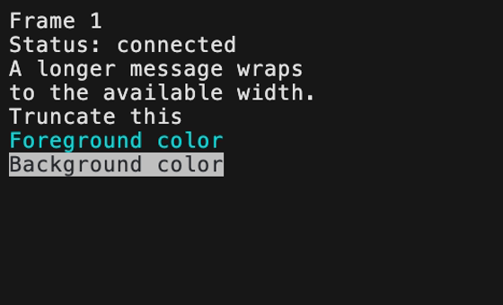

## Button

```csharp
using (imtui.HStack(gap: 1))
{
    imtui.Button("Focused");
    imtui.Button("Unfocused");
}
```

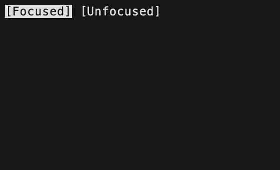

## InputText

```csharp
imtui.Theme = imtui.Theme with { Placeholder = TerminalColor.White };

using (imtui.VStack(gap: 1))
{
    imtui.Text("Profile");
    imtui.InputText(ref name, placeholder: "Name");
    imtui.InputText(ref email, placeholder: "Email");

    imtui.Text("Search");
    imtui.InputText(ref search, placeholder: "Search widgets");
}
```

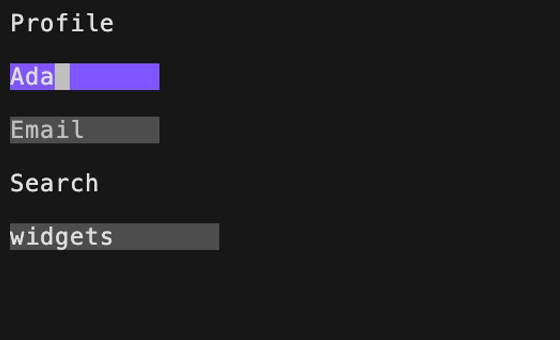

## Slider

```csharp
using (imtui.VStack(gap: 1))
{
    using (imtui.HStack(gap: 1))
    {
        imtui.Text("Volume");
        imtui.Slider(
            ref volume,
            min: 0,
            max: 100,
            style: new LayoutStyle { Width = LayoutLength.Fixed(18) }
        );
        imtui.Text($"{volume}%");
    }

    using (imtui.HStack(gap: 1))
    {
        imtui.Text("Brightness");
        imtui.Slider(
            ref brightness,
            min: 0,
            max: 100,
            style: new LayoutStyle { Width = LayoutLength.Fixed(18) }
        );
        imtui.Text($"{brightness}%");
    }

    using (imtui.HStack(gap: 1))
    {
        imtui.Text("Zoom");
        imtui.Slider(
            ref zoom,
            min: 0,
            max: 100,
            style: new LayoutStyle { Width = LayoutLength.Fixed(18) }
        );
        imtui.Text($"{zoom}%");
    }
}
```

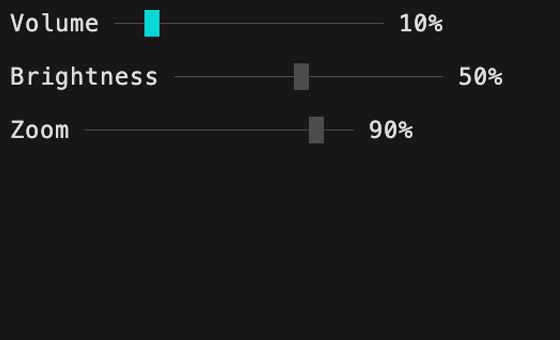

## ScalarInput

```csharp
using (imtui.VStack(gap: 1))
{
    using (imtui.HStack(gap: 1))
    {
        imtui.Text("Temperature");
        imtui.ScalarInput(ref temperature, min: -10, max: 10, width: 5);
    }

    using (imtui.HStack(gap: 1))
    {
        imtui.Text("Retries");
        imtui.ScalarInput(ref retries, min: 0, max: 10, width: 5);
    }

    using (imtui.HStack(gap: 1))
    {
        imtui.Text("Opacity");
        imtui.ScalarInput(ref opacity, min: 0m, max: 1m, step: 0.05m, format: "P0", width: 6);
    }
}
```

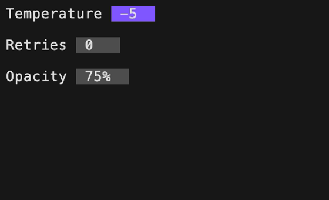

## Spinner

```csharp
using (imtui.VStack(gap: 1))
{
    using (imtui.HStack(gap: 1))
    {
        imtui.Spinner();
        imtui.Text("loading");
    }

    using (imtui.HStack(gap: 1))
    {
        imtui.Spinner(
            foregroundColor: TerminalColor.Cyan,
            glyphs: ['◐', '◓', '◑', '◒'],
            frameDuration: TimeSpan.FromMilliseconds(120)
        );
        imtui.Text("custom");
    }
}
```

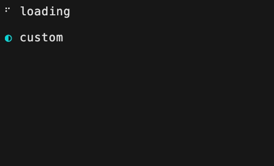

## Panel

```csharp
using (imtui.HStack(gap: 1))
{
    using (
        imtui.Panel(
            "No pad",
            style: new LayoutStyle
            {
                Width = LayoutLength.Fixed(10),
                Height = LayoutLength.Fixed(3),
            }
        )
    )
    {
        imtui.Text("Body");
    }

    using (
        imtui.Panel(
            "Square",
            BorderStyle.Square,
            padding: new Padding(1),
            style: new LayoutStyle
            {
                Width = LayoutLength.Fixed(12),
                Height = LayoutLength.Fixed(5),
            }
        )
    )
    {
        imtui.Text("Body");
    }

    using (
        imtui.Panel(
            borderStyle: BorderStyle.Ascii,
            padding: new Padding(1),
            style: new LayoutStyle
            {
                Width = LayoutLength.Fixed(12),
                Height = LayoutLength.Fixed(5),
            }
        )
    )
    {
        imtui.Text("ASCII");
    }
}
```

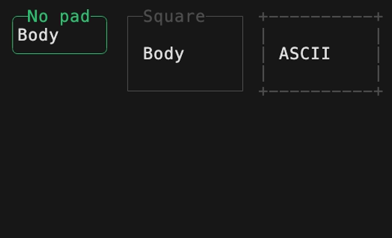

## Stacks

```csharp
using (imtui.HStack(gap: 4))
{
    using (imtui.VStack(gap: 1))
    {
        imtui.Text("VStack");
        imtui.Text("A");
        imtui.Text("B");
    }

    using (imtui.HStack(padding: new Padding(1), gap: 1))
    {
        imtui.Text("HStack");
        imtui.Text("with");
        imtui.Text("padding");
    }
}
```

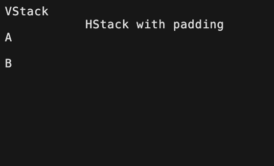

## HRule

```csharp
imtui.Text("Before");
imtui.HRule();
imtui.HRule("Section");
imtui.HRule("Fixed width", style: new LayoutStyle { Width = LayoutLength.Fixed(20) });
imtui.Text("After");
```

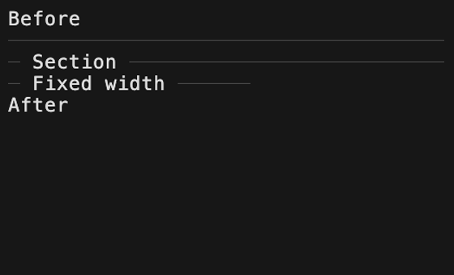

## VRule

```csharp
using (imtui.HStack(gap: 1))
{
    using (imtui.VStack())
    {
        imtui.Text("Left");
        imtui.Text("side");
    }
    imtui.VRule(style: new LayoutStyle { Height = LayoutLength.Fixed(2) });
    imtui.VRule(style: new LayoutStyle { Height = LayoutLength.Fixed(4) });
    using (imtui.VStack())
    {
        imtui.Text("Right");
        imtui.Text("side");
        imtui.Text("taller");
        imtui.Text("rule");
    }
}
```

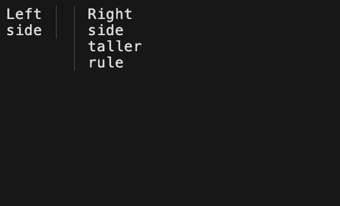

## DebugText

```csharp
imtui.DebugText();
```

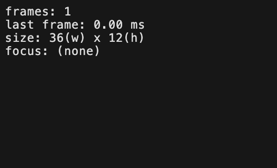
