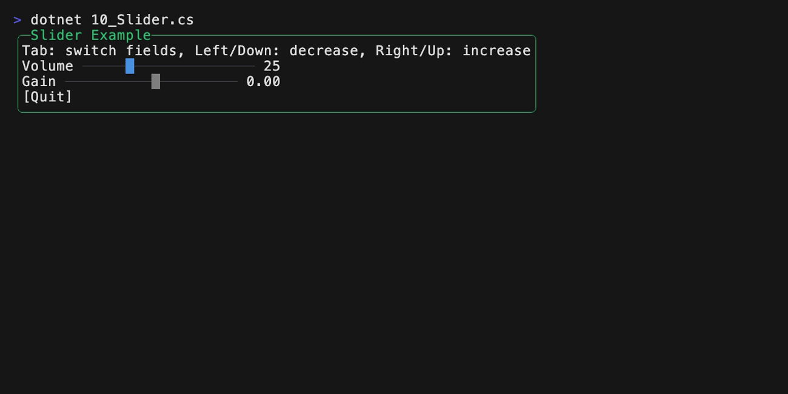
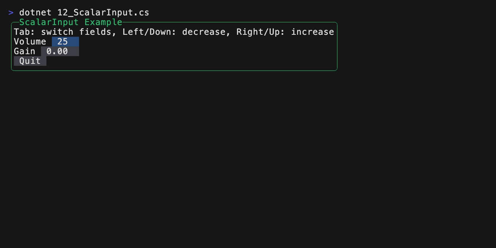
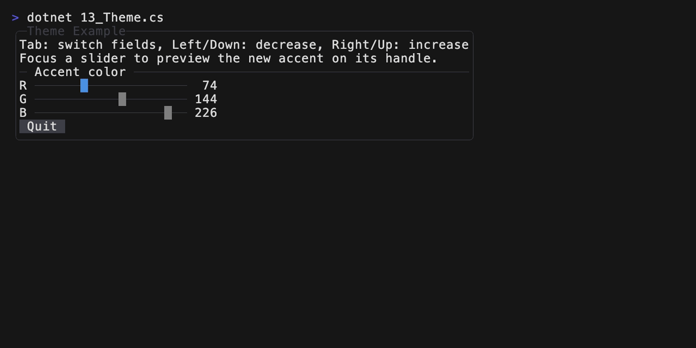
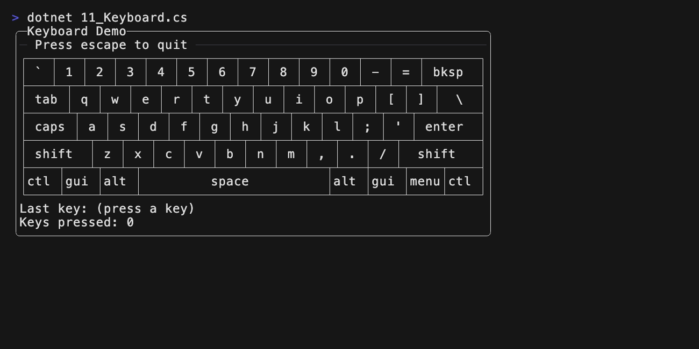
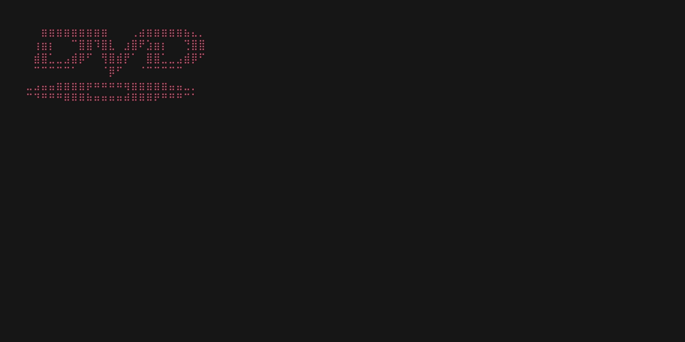

<!-- This file was generated from ./samples/README.template.md.
     Do not edit this file directly. -->

# Samples

## AltScreen mode

```csharp
int counter = 0;
AsphaltApplication.Run(asphalt =>
{
    using (asphalt.Panel("Alt-Screen Example"))
    {
        asphalt.Text("This sample takes over the full terminal using the alternate screen buffer.");

        asphalt.HRule("Buttons");
        if (asphalt.Button("Increment"))
            counter += 1;

        asphalt.Text($"Count: {counter}");

        if (asphalt.Button("Quit"))
            asphalt.QuitAfterThisFrame();
    }
}, altScreen: true);
```


## Debug Text

```csharp
using (asphalt.Panel("DebugText Example"))
{
    asphalt.Text("Press any key to advance a frame.");
    asphalt.HRule("asphalt.DebugText()");
    asphalt.DebugText();
    if (asphalt.Button("Quit"))
        asphalt.QuitAfterThisFrame();
}
```


## Spinner

```csharp
asphalt.HRule("Default (80ms)");
using (asphalt.HStack(gap: 1))
{
    asphalt.Spinner();
    asphalt.Spinner();
    asphalt.Spinner();
    asphalt.Text("loading...");
}

asphalt.HRule("Slower (250ms)");
using (asphalt.HStack(gap: 1))
{
    asphalt.Spinner(frameDuration: TimeSpan.FromMilliseconds(250));
    asphalt.Text("thinking...");
}
```


## Loading

```csharp
Task<string>? fetch = null;
CancellationTokenSource? cts = null;
AsphaltApplication.Run(
    asphalt =>
    {
        using (asphalt.Panel("Loading Example"))
        {
            asphalt.Text("A simulated network fetch wakes the run loop on completion.");
            asphalt.HRule();

            string buttonLabel = "Fetch";
            if (fetch is not null)
            {
                if (fetch.IsCompletedSuccessfully)
                {
                    asphalt.Text($"Result: {fetch.Result}");
                    buttonLabel = "Refetch";
                }
                else if (fetch.IsFaulted)
                {
                    asphalt.Text(
                        $"Failed: {fetch.Exception?.InnerException?.Message ?? "unknown error"}"
                    );
                    buttonLabel = "Try again";
                }
                else if (fetch.IsCanceled)
                {
                    asphalt.Text("Canceled");
                    buttonLabel = "Try again";
                }
                else
                {
                    asphalt.Spinner();
                    buttonLabel = "Cancel";
                }
            }
            else
            {
                asphalt.Text("Press the button to load.");
            }

            asphalt.HRule();
            if (asphalt.Button(buttonLabel))
            {
                if (fetch?.IsCompleted ?? true)
                {
                    cts = new CancellationTokenSource();
                    fetch = FetchAsync(cts.Token);
                }
                else
                {
                    cts?.Cancel();
                    cts?.Dispose();
                }

                // Re-draw as soon as the fetch completes so the UI will be updated
                // with the result.
                asphalt.WakeOn(fetch);
                // Re-draw immediately since the button is below the spinner, but
                // we want the spinner to show up right away.
                asphalt.RequestRedrawIn(TimeSpan.Zero);
            }

            if (asphalt.Button("Quit"))
                asphalt.QuitAfterThisFrame();

            asphalt.Text($"Frame Count: {asphalt.FrameCount}");
        }
    }
);
```


## Text Input

```csharp
using (asphalt.Panel("InputText Example"))
{
    asphalt.Text("Tab to move between fields. Type to edit. Enter on Quit to exit.");
    asphalt.HRule("Form");

    asphalt.Text("Name:");
    asphalt.InputText(ref name, placeholder: "your name");

    asphalt.Text("Email:");
    asphalt.InputText(ref email, placeholder: "you@example.com");

    asphalt.HRule("Live preview");
    asphalt.Text($"Hello, {(name.Length == 0 ? "stranger" : name)}!");
    if (email.Length > 0)
        asphalt.Text($"We'll reach you at {email}.");

    if (asphalt.Button("Quit"))
        asphalt.QuitAfterThisFrame();
}
```


## Slider

```csharp
using (asphalt.Panel("Slider Example"))
{
    asphalt.Text("Tab: switch fields, Left/Down: decrease, Right/Up: increase");
    using (asphalt.HStack(gap: 1))
    {
        asphalt.Text("Volume");
        asphalt.Slider(ref volume, min: 0, max: 100, step: 5);
        asphalt.Text(volume.ToString());
    }
    using (asphalt.HStack(gap: 1))
    {
        asphalt.Text("Gain");
        asphalt.Slider(ref gain, min: -1.0, max: 1.0, step: 0.05);
        asphalt.Text($"{gain:+0.00;-0.00;0.00}");
    }
    if (asphalt.Button("Quit"))
    {
        asphalt.QuitAfterThisFrame();
    }
}
```



## ScalarInput

```csharp
using (asphalt.Panel("ScalarInput Example"))
{
    asphalt.Text("Tab: switch fields, Left/Down: decrease, Right/Up: increase");
    using (asphalt.HStack(gap: 1))
    {
        asphalt.Text("Volume");
        asphalt.ScalarInput(ref volume, min: 0, max: 100, step: 5);
    }
    using (asphalt.HStack(gap: 1))
    {
        asphalt.Text("Gain");
        asphalt.ScalarInput(ref gain, min: -1.0, max: 1.0, step: 0.05, format: "+0.00;-0.00;0.00");
    }
    if (asphalt.Button("Quit"))
    {
        asphalt.QuitAfterThisFrame();
    }
}
```



## Theme

```csharp
asphalt.Theme = asphalt.Theme with
{
    Accent = TerminalColor.Rgb((byte)red, (byte)green, (byte)blue),
};

using (asphalt.Panel("Theme Example"))
{
    asphalt.Text("Tab: switch fields, Left/Down: decrease, Right/Up: increase");
    asphalt.Text("Focus a slider to preview the new accent on its handle.");
    asphalt.HRule("Accent color");
    using (asphalt.HStack(gap: 1))
    {
        asphalt.Text("R");
        asphalt.Slider(ref red, min: 0, max: 255, step: 5);
        asphalt.Text($"{red,3}");
    }
    using (asphalt.HStack(gap: 1))
    {
        asphalt.Text("G");
        asphalt.Slider(ref green, min: 0, max: 255, step: 5);
        asphalt.Text($"{green,3}");
    }
    using (asphalt.HStack(gap: 1))
    {
        asphalt.Text("B");
        asphalt.Slider(ref blue, min: 0, max: 255, step: 5);
        asphalt.Text($"{blue,3}");
    }

    if (asphalt.Button("Quit"))
        asphalt.QuitAfterThisFrame();
}
```



## Custom Widget

A custom widget built entirely from the public API.
See [11_Keyboard.cs](./11_Keyboard.cs).



## Bouncing DVD

A bouncing-DVD screensaver built as a custom `IWidget`. App-level state
(position, velocity, color index) lives as plain locals captured by the
run-loop lambda; the widget itself is stateless and just paints the logo
at the current position.

See [15_Dvd.cs](./15_Dvd.cs).


