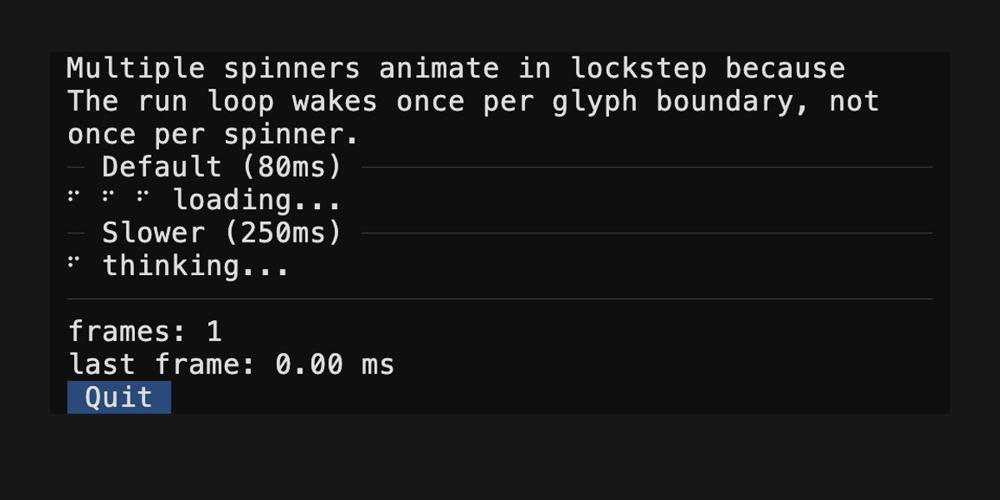
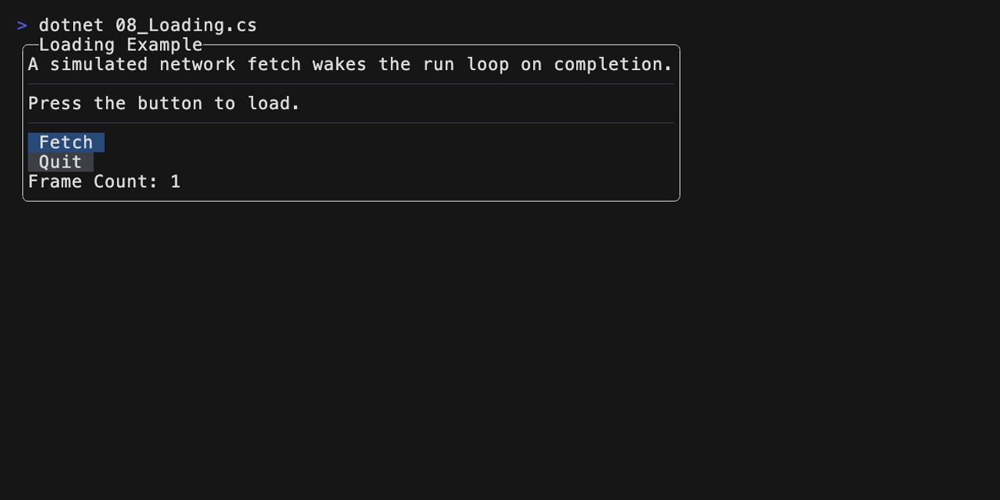
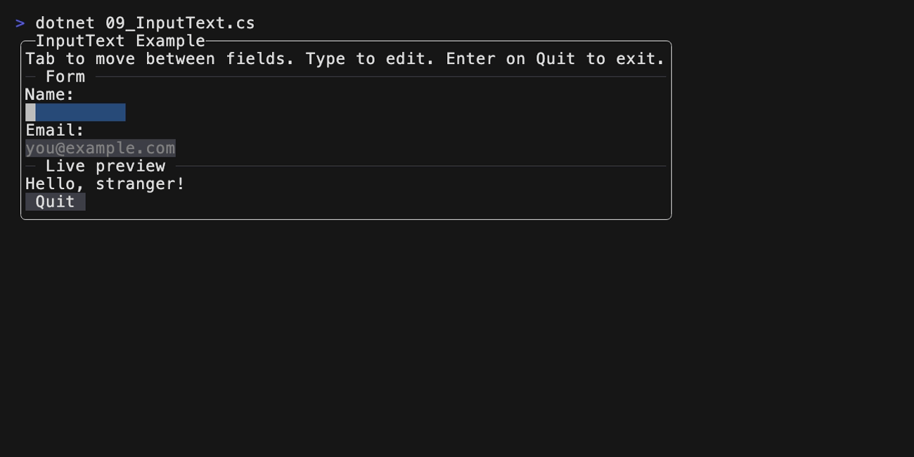

<!-- This file was generated from ./samples/README.template.md.
     Do not edit this file directly. -->

# Samples

## AltScreen mode

```csharp
int counter = 0;
ImtuiApplication.Run(imtui =>
{
    using (imtui.Panel("Alt-Screen Example"))
    {
        imtui.Text("This sample takes over the full terminal using the alternate screen buffer.");

        imtui.HRule("Buttons");
        if (imtui.Button("Increment"))
            counter += 1;

        imtui.Text($"Count: {counter}");

        if (imtui.Button("Quit"))
            imtui.QuitAfterThisFrame();
    }
}, altScreen: true);
```


## Debug Text

```csharp
using (imtui.BorderPanel("DebugText Example"))
{
    imtui.Text("Press any key to advance a frame.");
    imtui.HRule("imtui.DebugText()");
    imtui.DebugText();
    if (imtui.Button("Quit"))
        imtui.QuitAfterThisFrame();
}
```


## Spinner

```csharp
imtui.HRule("Default (80ms)");
using (imtui.HStack(gap: 1))
{
    imtui.Spinner();
    imtui.Spinner();
    imtui.Spinner();
    imtui.Text("loading...");
}

imtui.HRule("Slower (250ms)");
using (imtui.HStack(gap: 1))
{
    imtui.Spinner(frameDuration: TimeSpan.FromMilliseconds(250));
    imtui.Text("thinking...");
}
```



## Loading

```csharp
Task<string>? fetch = null;
CancellationTokenSource? cts = null;
ImtuiApplication.Run(
    imtui =>
    {
        using (imtui.BorderPanel("Loading Example"))
        {
            imtui.Text("A simulated network fetch wakes the run loop on completion.");
            imtui.HRule();

            string buttonLabel = "Fetch";
            if (fetch is not null)
            {
                if (fetch.IsCompletedSuccessfully)
                {
                    imtui.Text($"Result: {fetch.Result}");
                    buttonLabel = "Refetch";
                }
                else if (fetch.IsFaulted)
                {
                    imtui.Text(
                        $"Failed: {fetch.Exception?.InnerException?.Message ?? "unknown error"}"
                    );
                    buttonLabel = "Try again";
                }
                else if (fetch.IsCanceled)
                {
                    imtui.Text("Canceled");
                    buttonLabel = "Try again";
                }
                else
                {
                    imtui.Spinner();
                    buttonLabel = "Cancel";
                }
            }
            else
            {
                imtui.Text("Press the button to load.");
            }

            imtui.HRule();
            if (imtui.Button(buttonLabel))
            {
                if (fetch?.IsCompleted ?? true)
                {
                    cts = new CancellationTokenSource();
                    fetch = FetchAsync(cts.Token);
                }
                else
                {
                    cts?.Cancel();
                    cts?.Dispose();
                }

                // Re-draw as soon as the fetch completes so the UI will be updated
                // with the result.
                imtui.WakeOn(fetch);
                // Re-draw immediately since the button is below the spinner, but
                // we want the spinner to show up right away.
                imtui.RequestRedrawIn(TimeSpan.Zero);
            }

            if (imtui.Button("Quit"))
                imtui.QuitAfterThisFrame();

            imtui.Text($"Frame Count: {imtui.FrameCount}");
        }
    }
);
```



## Text Input

```csharp
using (imtui.BorderPanel("InputText Example"))
{
    imtui.Text("Tab to move between fields. Type to edit. Enter on Quit to exit.");
    imtui.HRule("Form");

    imtui.Text("Name:");
    imtui.InputText(ref name, placeholder: "your name");

    imtui.Text("Email:");
    imtui.InputText(ref email, placeholder: "you@example.com");

    imtui.HRule("Live preview");
    imtui.Text($"Hello, {(name.Length == 0 ? "stranger" : name)}!");
    if (email.Length > 0)
        imtui.Text($"We'll reach you at {email}.");

    if (imtui.Button("Quit"))
        imtui.QuitAfterThisFrame();
}
```


