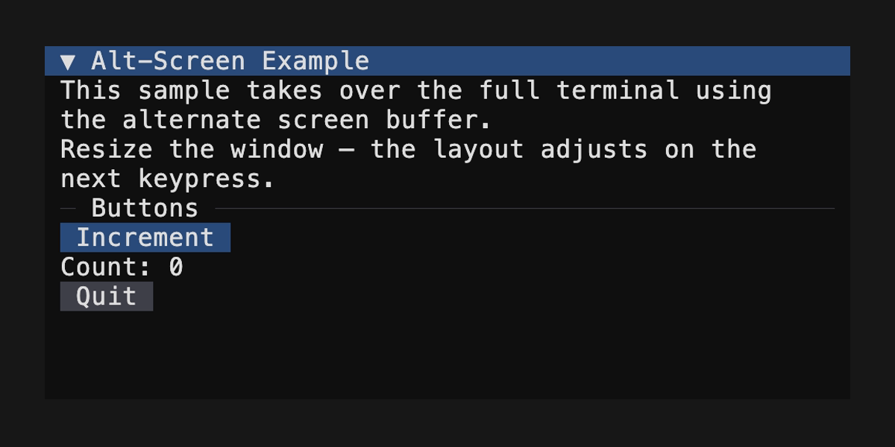
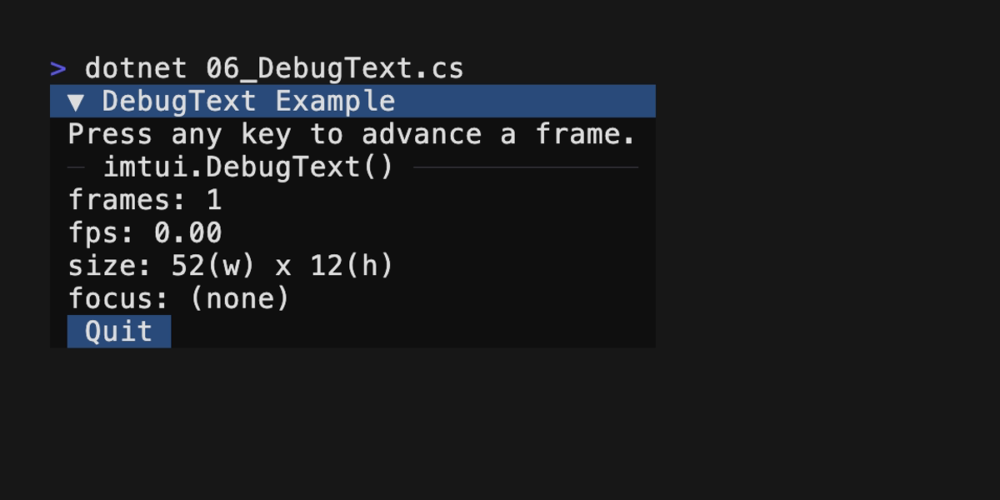

<!-- This file was generated from ./scripts/templates/samples.md.liquid.
     Do not edit this file directly. -->

# Samples


## 00_TextWrapping.cs


```csharp

```


## 01_LayoutDemo.cs


```csharp

```


## 05_AltScreen.cs





```csharp

```


## 06_DebugText.cs





```csharp
using (imtui.Panel("DebugText Example"))
{
    imtui.Text("Press any key to advance a frame.");
    imtui.HRule("imtui.DebugText()");
    imtui.DebugText();
    if (imtui.Button("Quit"))
        keepRunning = false;
}
```


## 02_TextLayout.cs


```csharp

```


## 03_ShadowBox.cs


```csharp

```


## 04_ApplicationLoop.cs


```csharp

```

